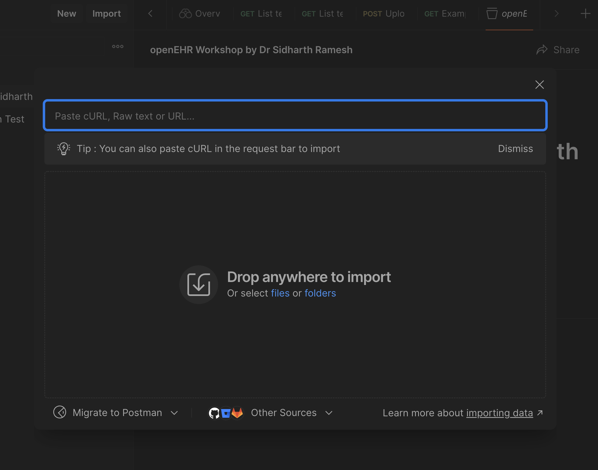

# openEHR Workshop by Dr Sidharth Ramesh: Master openEHR in 90 mins

This repository contains the Postman collection and environment for the openEHR Workshop by Dr Sidharth Ramesh.

## Prerequisites

- Postman Desktop App (https://www.postman.com/downloads/)
- Postman API Client (https://www.postman.com/downloads/)
- Postman API Client CLI (https://www.postman.com/downloads/)

## Importing the collection and environment
1. Open the Postman Desktop Application
2. Create a workspace if not already created
3. Import the collection by pasting in the following URL in the import dialog:



```
https://raw.githubusercontent.com/medblocks/openehr-workshop-by-dr-sidharth-ramesh/main/openEHR%20Workshop%20by%20Dr%20Sidharth%20Ramesh.postman_collection.json
```
4. Import the environment by pasting in the following URL in the import dialog:
```
https://raw.githubusercontent.com/medblocks/openehr-workshop-by-dr-sidharth-ramesh/main/Medblocks%20openEHR%20Bootcamp.postman_environment.json
```

## Running EHRbase locally
If you want to host an instance of the openEHR server locally, you can use the following steps:

1. Clone the repository
2. Make sure you have docker and docker compose installed (https://docs.docker.com/get-docker/)
3. Run the `docker-compose.yml` file using `docker compose up`
4. The EHRbase server will be running on port 8080
5. Replace the `baseUrl` in the environment with `http://localhost:8080/ehrbase`

If you're interested in building 5 openEHR applications in 10 weeks, you can check out the Medblocks openEHR Bootcamp (https://medblocks.com/openehr-bootcamp).